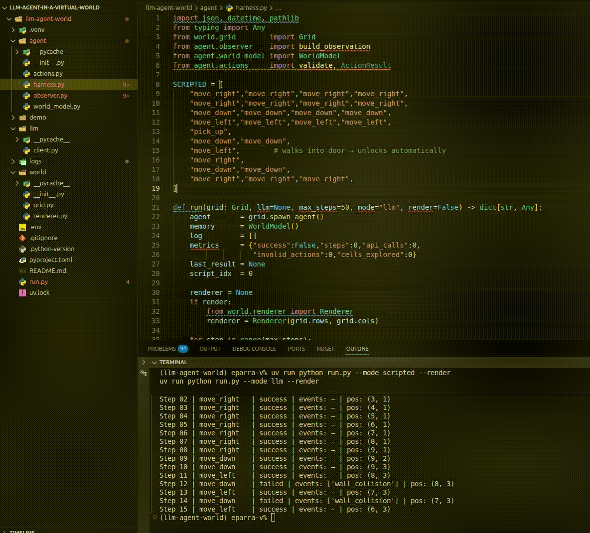

# LLM Agent in a Virtual World

A Claude-powered agent that navigates a 2D grid maze: find the key, unlock the door, reach the goal.



---

## What it does

The agent runs a perception → reasoning → action loop at every step:

1. **Observer** builds a text observation from the local grid view, known world state, and a navigation hint.
2. **LLM** (Claude Haiku) reads the observation and responds with a JSON action.
3. **Harness** executes the action on the grid and feeds the result back.

Two modes are available: `scripted` (hard-coded optimal path, no API calls) and `llm` (live Claude inference).

---

## Setup

### 1. Install uv

[uv](https://docs.astral.sh/uv/) is the package manager used by this project.

```bash
curl -LsSf https://astral.sh/uv/install.sh | sh
```

### 2. Install dependencies

```bash
uv sync
```

This creates a virtual environment and installs all packages listed in `pyproject.toml`, including `anthropic` and `pygame-ce`.

### 3. Set your API key

An **Anthropic API key** is required to run the LLM mode. Create a `.env` file in the project root and add your key — never commit this file:

```
ANTHROPIC_API_KEY=sk-ant-...
```

> `.env` is already in `.gitignore`. Do not hardcode credentials anywhere in the source.

---

## Running

### Scripted agent (no API key needed)

```bash
uv run python run.py --mode scripted
```

### LLM agent (requires API key)

```bash
uv run python run.py --mode llm
```

### With Pygame visualisation

Add `--render` to either mode to open a graphical window:

```bash
uv run python run.py --mode scripted --render
uv run python run.py --mode llm --render
```

---

## Project layout

```
run.py              entry point, map definition, CLI flags
agent/
  harness.py        main loop: observe → act → log
  observer.py       builds the text observation sent to the LLM
  world_model.py    tracks key/door/goal locations and inventory across steps
  actions.py        action names, descriptions, and validation
llm/
  client.py         Anthropic API wrapper (reads ANTHROPIC_API_KEY from env)
world/
  grid.py           grid state, movement, events (found_key, door_unlocked, …)
  renderer.py       Pygame visualisation
logs/               per-run JSON logs saved automatically
demo/
  demo.gif          screen recording of a successful LLM run
```

---

## Map legend

| Symbol | Meaning |
|--------|---------|
| `#`    | Wall |
| `.`    | Empty cell |
| `?`    | Unexplored (partial observability) |
| `K`    | Key |
| `D`    | Door (requires key to unlock) |
| `G`    | Goal |
| `A`    | Agent start position |
